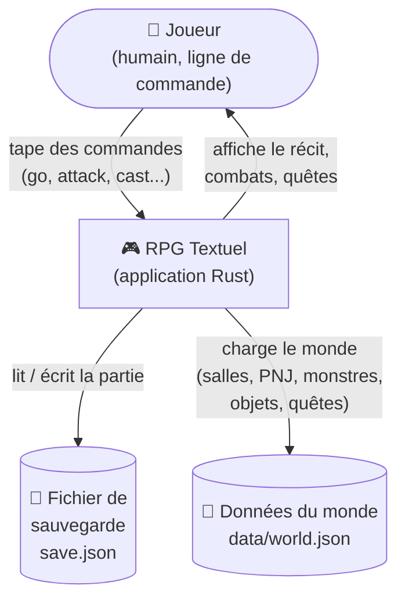
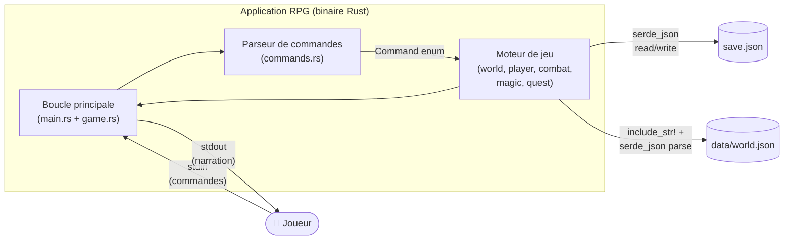
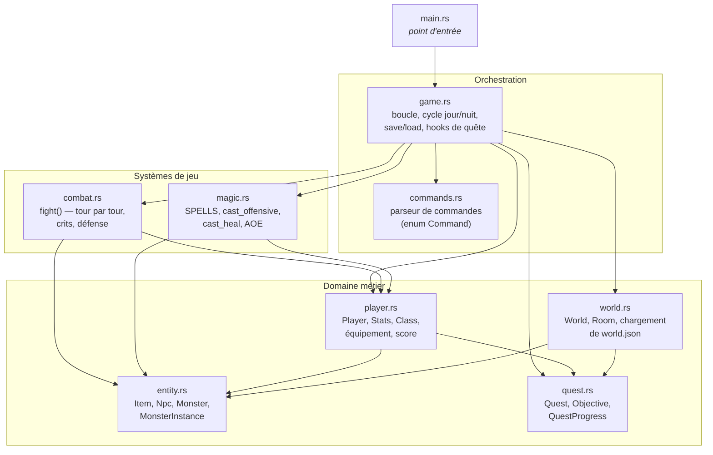
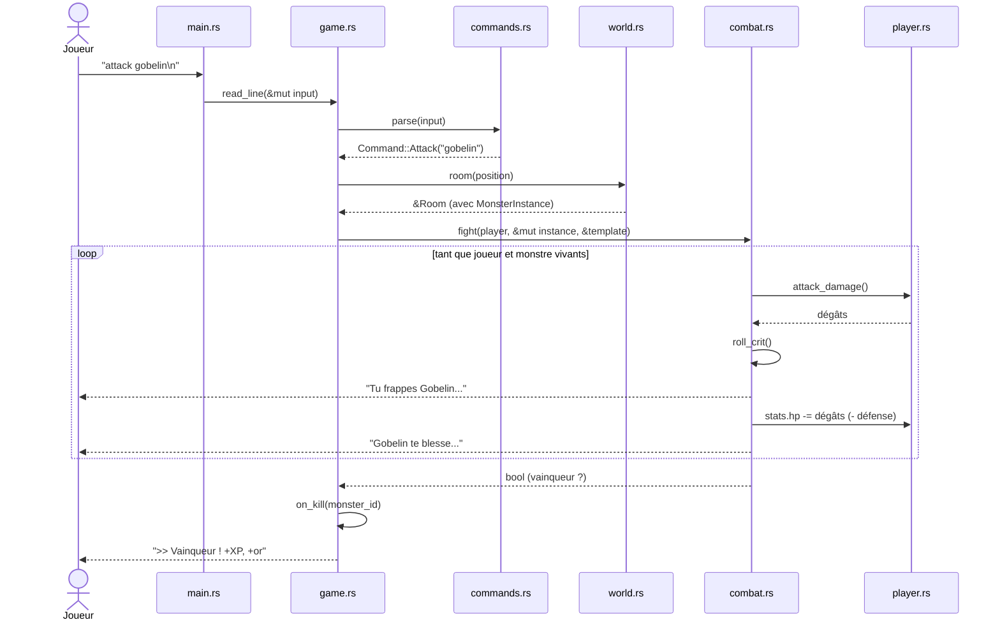
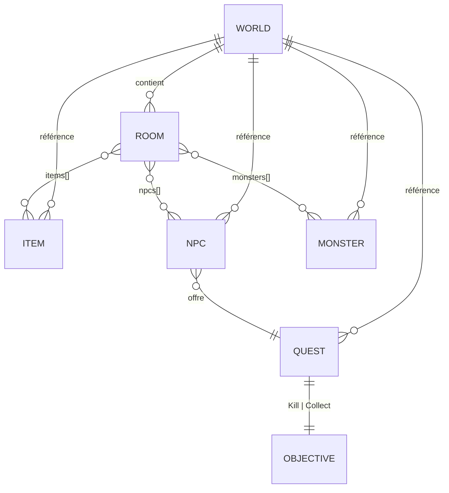

# Architecture du projet — Modélisation C4

Ce document présente l'architecture du jeu **RPG Textuel en Rust** selon le modèle **C4**
(Context / Containers / Components), proposé par Simon Brown.

Les diagrammes sont écrits en **Mermaid** : ils s'affichent automatiquement sur GitHub /
VS Code et peuvent être exportés en image.

---

## 1. Contexte (Niveau 1 — System Context)

Vue d'ensemble : qui utilise le système et avec quoi il interagit.

**Acteurs** :
- **Joueur** : humain qui joue depuis un terminal.
- **RPG Textuel** : le programme Rust, cœur du système.
- **Fichier de sauvegarde** (`save.json`) : persistance d'une partie en cours.
- **Données du monde** (`data/world.json`) : description statique de l'univers.

---

## 2. Conteneurs (Niveau 2 — Containers)

Le projet est une **application monolithique** en Rust : tout tourne dans le même binaire.
On distingue les flux entre l'exécutable et le système de fichiers.

**Choix techniques** :
- **Rust 1.96+** (toolchain GNU sous Windows).
- **serde / serde_json** : (dé)sérialisation JSON.
- **rand** : aléa pour le combat, les coups critiques, les sorts AOE.
- **Pas de framework**, pas de réseau, pas de base de données.

---

## 3. Composants (Niveau 3 — Components)

Découpage interne du binaire en modules Rust. Chaque module a une responsabilité claire
(SRP). Les flèches montrent les dépendances `use crate::...`.

### Responsabilités détaillées

| Module | Responsabilité |
|--------|----------------|
| `main.rs` | Point d'entrée. Crée et lance `Game::new`. |
| `game.rs` | Boucle de jeu, dispatch des commandes, sauvegarde, cycle jour/nuit, respawn, hooks de quête. |
| `commands.rs` | Parsing du texte saisi par le joueur en variantes typées (`Command::Go(...)`, `Command::Attack(...)`...). |
| `world.rs` | Représentation du monde et chargement initial du JSON. |
| `entity.rs` | Structures de données partagées (`Item`, `Npc`, `Monster`, `MonsterInstance`). |
| `player.rs` | État du personnage : stats, classe, inventaire, équipement, sorts connus, journal de quêtes. |
| `combat.rs` | Algorithme de combat tour par tour (attaque physique, défense, coups critiques). |
| `magic.rs` | Définition statique des sorts, calcul des dégâts magiques, soin, sorts de zone. |
| `quest.rs` | Modèle de quête : objectif (Kill / Collect), progression, état terminé. |

---

## 4. Cycle de vie d'une commande (Diagramme de séquence)

Exemple : le joueur tape `attack gobelin`.

---

## 5. Choix de conception (POO en Rust)

Rust n'a pas d'héritage classique, mais le projet applique les principes objet via :

- **Encapsulation** : chaque struct expose des méthodes (`Player::use_item`,
  `Stats::gain_xp`, `World::load`...).
- **Polymorphisme par enum** :
  - `Command` (enum) modélise toutes les actions du joueur.
  - `Objective` (enum tagué) modélise `Kill` / `Collect`.
  - `Class` (enum) modélise Guerrier / Mage / Voleur.
- **Composition** : `Game` agrège un `World` et un `Player` ; `Player` contient des
  `Stats`, des `Item`, des `QuestProgress`...
- **Sérialisation transparente** : `#[derive(Serialize, Deserialize)]` sur toutes les
  structures persistantes permet `save` / `load` quasi gratuits.

---

## 6. Données externes

`data/world.json` contient :

Le format JSON sépare clairement **structure du monde** (rooms) et **catalogue**
(items, npcs, monsters, quests), ce qui rend l'extension du jeu très simple :
ajouter une zone ou un boss = éditer un fichier de données, sans toucher au code.
